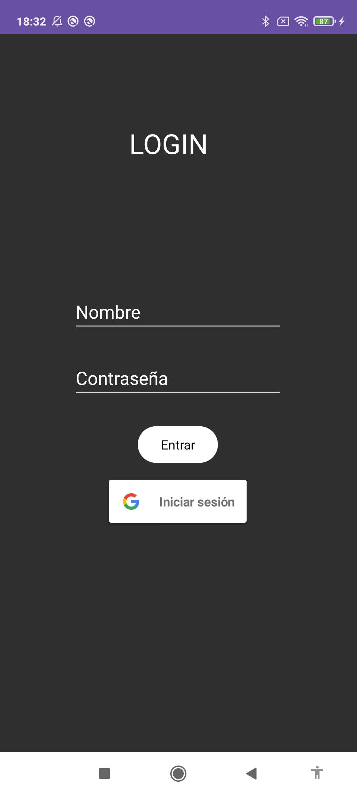
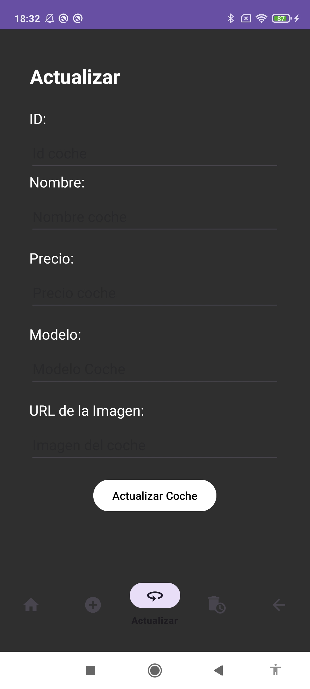
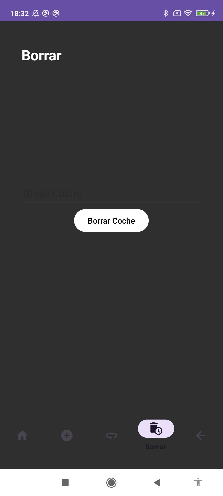

# MultimediaFinal
# Proyecto de Aplicación de Coches

## Descripción del Proyecto

Esta aplicación de Android Studio tiene como temática principal la gestión de información sobre coches. Permite a los usuarios realizar operaciones como agregar nuevos coches, actualizar la información existente, eliminar coches y visualizar la lista de coches disponibles.

## Componentes Obligatorios

### Activities

1. **Login Activity:** Permite a los usuarios iniciar sesión en la aplicación.

2. **Main Activity:** Después de un inicio de sesión exitoso, redirige a los usuarios a la actividad principal.

### Fragments

1. **Home Fragment:** Realiza automáticamente una consulta para obtener todos los coches y muestra la lista.

2. **Add Car Fragment:** Permite al usuario agregar un nuevo coche.

3. **Update Car Fragment:** Permite al usuario modificar la información de un coche existente.

4. **Delete Car Fragment:** Permite al usuario eliminar un coche existente.

### Botones

- Integración de botones en varias pantallas para realizar acciones específicas.

### Campos de Texto

- Campos de texto para introducir información relacionada con los coches.

### Listas

- Muestra la lista de coches con al menos el nombre y una breve descripción debajo de cada elemento.

### Barra de Navegación Inferior

- Implementa una barra de navegación inferior para facilitar la transición entre fragments.
- Incluye un botón para cerrar sesión y regresar a la actividad de inicio de sesión.

### Toasts

- Notifica mediante Toast la creación, modificación o eliminación de elementos (coches).
- Informa mediante Toast si el inicio de sesión es correcto o incorrecto.

### Comentarios y Javadoc

- El código está debidamente comentado utilizando Javadoc para facilitar la comprensión y mantenimiento.

## Versiones y Dependencias

- Android Studio: [Versión X.X.X]
- Bibliotecas y dependencias utilizadas: [Lista de dependencias]

## Pantallazos y Explicación

### Pantalla de Inicio de Sesión

)

- Pantalla donde los usuarios inician sesión.

### Pantalla Principal

- Muestra la lista de coches y proporciona acceso a diferentes funciones mediante la barra de navegación inferior.

### Agregar Coche

- Permite a los usuarios agregar un nuevo coche proporcionando la información necesaria.

### Modificar Coche

- Permite a los usuarios actualizar la información de un coche existente.

### Eliminar Coche

- Permite a los usuarios eliminar un coche existente de la lista.

---

Este README proporciona una visión general del proyecto, incluyendo capturas de pantalla de cada pantalla junto con explicaciones detalladas. Además, se detallan las versiones, dependencias y otros detalles relevantes para la comprensión y reproducción del proyecto.
